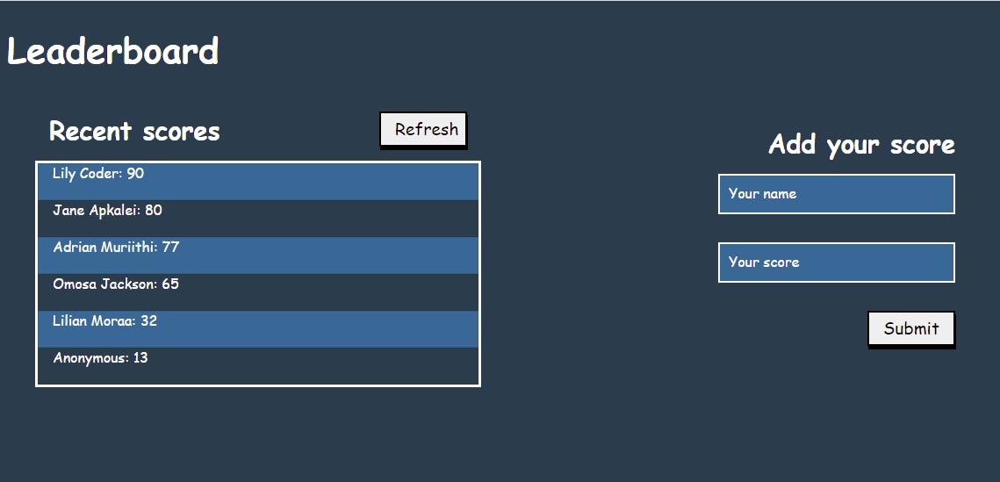

# Leaderboard

> The leaderboard website displays scores submitted by different players. It also allows you to submit your score. All data is preserved thanks to the external Leaderboard API service. For this application the priority is to create a working version of the leaderboard that preserves user input.
## Live Demo
[Live Demo](https://lily-coder.github.io/leaderboard/)

## Screenshot

## Built With

- Html5 and Css3
- Javascript
- Webpack

### Setup
To get a local copy up and running follow these simple example steps.

- git clone the repo using this [link](https://github.com/lily-coder/leaderboard.git)
- cd into the folder
- git checkout `branch-name`
- run `npm i`
- run `npm start`

## Authors

👤 **Lilian Moraa**

- GitHub: [@lily-coder](https://github.com/lily-coder/lily-coder)
- LinkedIn: [lilian-moraa-99950b1b8](https://www.linkedin.com/in/lilian-moraa-99950b1b8)

## 🤝 Contributing

Contributions, issues, and feature requests are welcome!

Feel free to check the [issues page](https://github.com/lily-coder/leaderboard/issues/).

## Show your support

    Please give a⭐️if you love this project.
## Acknowledgments

- Hat tip to anyone whose code was used
- Inspiration
- etc

## 📝 License

This project is [MIT](./MIT.md) licensed.